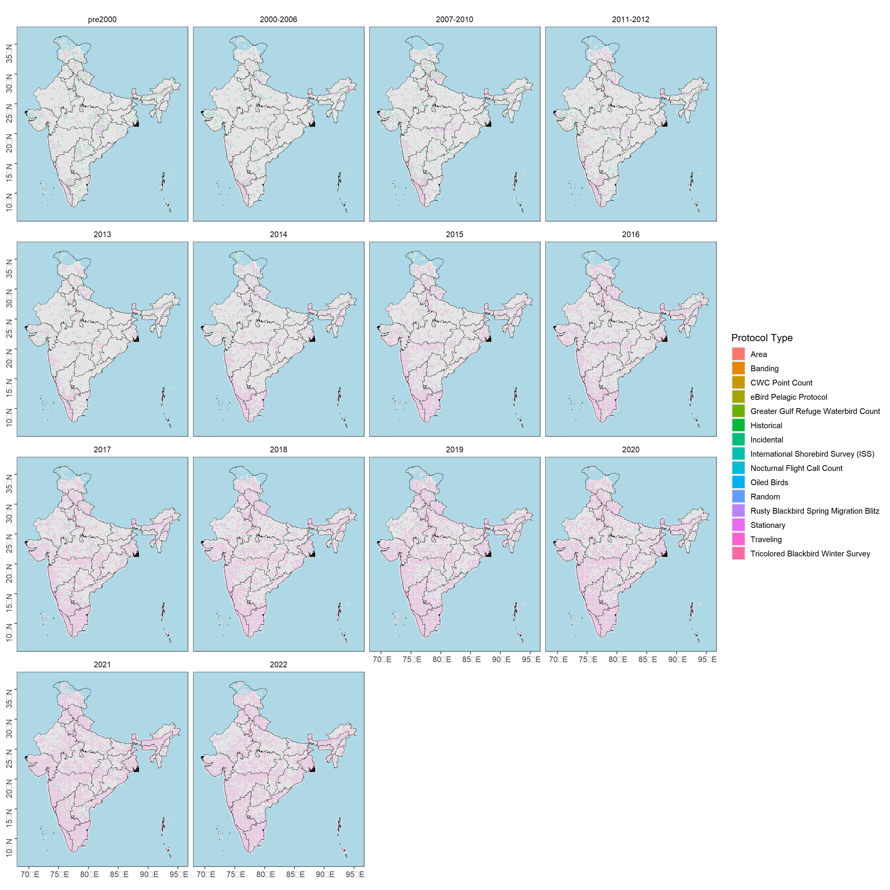

```{r}
# load libraries
library(data.table)
library(readxl)
library(magrittr)
library(stringr)
library(dplyr)
library(tidyr)
library(readr)
library(ggplot2)
library(ggthemes)
library(scico)
library(extrafont)
library(sf)
library(rnaturalearth)
library(lme4)
library(multcomp)
library(sjPlot)
library(ggstatsplot)
library(paletteer)
library(pals)
```

## For visualization of Protocol type - spatial (25kmx25km) and temporal (Pre 2000 to recent)
```{r}
# subset data by time period
ebd_in <- ebd_in %>%
  mutate(timePeriod = case_when(
    year <= 1999 ~ "pre2000",
    year > 1999 & year <= 2006 ~ "2000-2006",
    year > 2006 & year <= 2010 ~ "2007-2010",
    year > 2010 & year <= 2012 ~ "2011-2012",
    year == 2013 ~ "2013",
    year == 2014 ~ "2014",
    year == 2015 ~ "2015",
    year == 2016 ~ "2016",
    year == 2017 ~ "2017",
    year == 2018 ~ "2018",
    year == 2019 ~ "2019",
    year == 2020 ~ "2020",
    year == 2021 ~ "2021",
    year == 2022 ~ "2022"
  ))

## count checklists in cell
ebd_summary <- ebd_in[, nchk := length(unique(sampling_event_identifier)),
  by = .(X, Y, timePeriod)]

# count checklists with different protocol_type (Historical, Incidental, Stationary, Traveling etc) in cell and get proportion
ebd_summary_protocol <- ebd_summary[, .(nrep = length(unique(
  sampling_event_identifier
))),
by = .(X, Y, nchk, protocol_type, timePeriod)
]
ebd_summary_protocol[, p_rep := nrep / nchk]

# complete the dataframe for no reports
# keep no reports as NA --- allows filtering based on proportion reporting
ebd_summary_protocol <- setDF(ebd_summary_protocol) %>%
  complete(
    nesting(X, Y), protocol_type, timePeriod # ,
    # fill = list(p_rep = 0)
  ) %>%
  filter(!is.na(p_rep))

# protocol-specific number of grids by time Period
protocol_grids <- ebd_summary %>%
  group_by(protocol_type, timePeriod) %>%
  distinct(X, Y) %>%
  count(protocol_type,
    name = "n_grids"
  )

# Write the above result

write.csv(protocol_grids, "results/ngrids-protocol_type-by-timePeriod.csv", row.names=F)

```

## mapping protocol type by time period

```{r}
plotprotocol <-
  ggplot() +
  geom_sf(data = land, fill = "grey90", col = NA) +
  geom_tile(
    data = ebd_summary_protocol,
    aes(X, Y, fill = protocol_type), lwd = 0.5, col = "grey90"
  ) + geom_sf(data = india_states, fill = NA, col = "black", lwd = 0.3) +
  facet_wrap(~timePeriod) +
  coord_sf(xlim = bbox[c("xmin", "xmax")], ylim = bbox[c("ymin", "ymax")]) +
  theme_few() +
  theme(
    legend.position = "right",
    axis.title = element_blank(),
    axis.text.y = element_text(angle = 90),
    panel.background = element_rect(fill = "lightblue")
  ) +
  labs(fill = "Protocol Type")

# export data
ggsave(plotprotocol,
  filename = "figs/fig_protocoltype_25km_by_timePeriod.png", height = 15,  width = 15, device = png(), dpi = 300
)
dev.off()
```



## Figure: violinplot of protocol type by time period
```{r}
# create log values of nChk
ebd_summary_protocol$logNchk <- log(ebd_summary_protocol$nchk)

#ggbetweenstats color palette might give issue so do following steps
fig_protocoltype_time <- grouped_ggbetweenstats(
  data = ebd_summary_protocol,
  x = timePeriod,
  y = logNchk,
  grouping.var = protocol_type,
  type = "robust", ## type of statistics
  xlab = "Time Period", 
  ylab = "log Number of checklists",
  plot.type = "boxviolin",
  pairwise.comparisons = F,
  annotation.args = list (title = "Distribution of checklists by time period for different Protocol Types across 25cx 25 km grids"),
  plotgrid.args = list(nrow = 5),
  package = "pals",
  palette = "glasbey")+
  theme(plot.title = element_text(family = "Century Gothic",
      size = 18, face = "bold"),
    axis.title = element_text(family = "Century Gothic",
      size = 18, face = "bold"),
        axis.text = element_text(family="Century Gothic",size = 18),
      plot.subtitle = element_text(
      family = "Century Gothic", 
      size = 18, 
      face = "bold",
      color="#1b2838"
    ))

ggsave(fig_protocoltype_time, filename="figs/fig_checklist_protocol_timeperiod.pdf", width = 40, height = 40)
dev.off()

#statistical differences in a dataframe

stats_protocol_timePeriod_logNChk <- pairwise_comparisons(ebd_summary_protocol, protocol_type, logNchk, type = "robust") %>%
  filter(p.value <= 0.05) %>%
  data.frame()

write.csv(stats_protocol_timePeriod_logNChk[,-10], "results/02_pairwiseComparisons_protocoltype_logNchk.csv", row.names = F)
```
 

